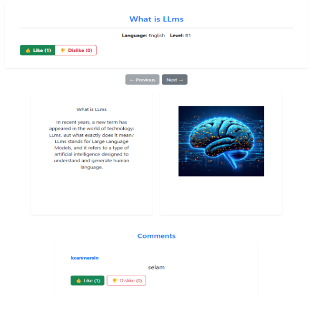
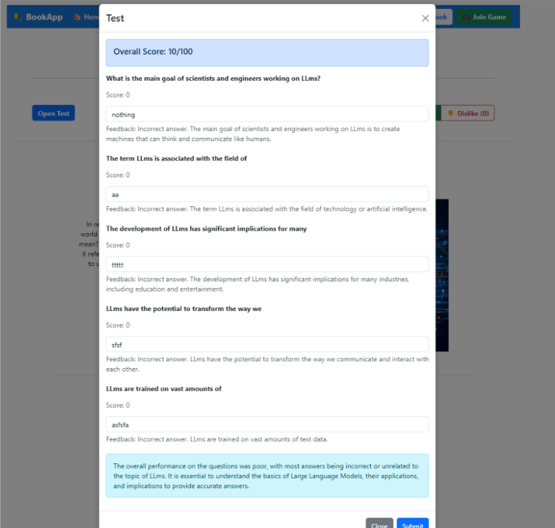

# InkSpire.AI

InkSpire.AI is a language learning platform that uses AI to generate stories and quizzes tailored to your proficiency level. 

With InkSpire.AI you can:
* Generate custom stories on any topic you're interested in, powered by advanced LLM technology
* Take automatically created tests about the content you just read, generated by AI
* Get your answers evaluated with detailed feedback through LLM-powered assessment
* Save unknown words to your personal vocabulary list
* Use the built-in translation module to understand difficult words
* Practice with multiplayer language games that use AI to verify answers
* Track your progress as you improve your language skills

## Screenshots

## Technology Stack

### Backend
- ASP.NET Core
- Clean Architecture with CQRS and MediatR
- Elasticsearch for search
- RabbitMQ for message queuing
- GroqLLM for AI content generation
- Cloudinary for image storage
- SignalR for real-time features

### DevOps
- Kibana for log visualization and analytics
- Nginx for reverse proxy and load balancing
- Prometheus for monitoring and alerting
- Health checks for system reliability